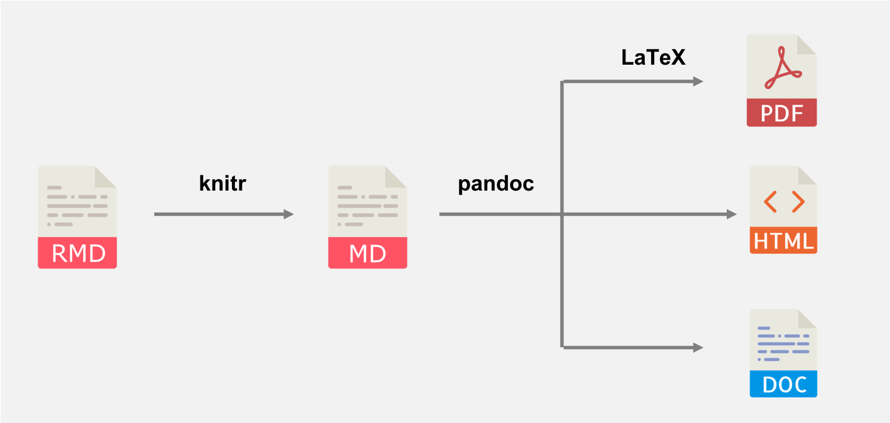

```{r setup, include=FALSE}
# DO NOT ALTER CODE IN THIS CHUNK
# Set knitr options
knitr::opts_chunk$set(
  echo = TRUE, eval = TRUE, fig.width = 5,
  fig.asp = 0.618, out.width = "80%", dpi = 120,
  fig.position = "!h", cache = FALSE
)
# Load packages
suppressPackageStartupMessages(library(tidyverse))
```

---

## Exercise 2

| Column 1 | Column 2 | Column 3 | Column 4 |
| --- | ---: | :---: | :--- |
| Notice | what | the | colons |
| are | doing? | | |

Table: The table with poor spacing

| Column 1 | Column 2 | Column 3 | Column 4 |
| -------- | -------: | :------: | :------- |
| Notice   | what     | the      | colons   |
| are      | doing?   |          |          |

Table: The table with good spacing

* Both tables look the same after being rendered.


## Exercise 3




## Exercise 4
Lorem ipsum dolor sit amet, consectetur adipiscing elit, sed do eiusmod tempor incididunt ut labore et dolore magna aliqua.

    Lorem ipsum dolor sit amet, consectetur adipiscing elit, sed do eiusmod tempor incididunt ut labore et dolore magna aliqua.

* The effect of adding 4 spaces at the start of the line turns the regular text into a code-like text.  
* Spaces at the beginning of lines can cause automatic text wrapping to fail, especially when viewing the text on multiple devices or modifying the window size.  

## Exercise 5
$c = \sqrt{a^2 + b^2}$


## Exercise 6

```{r, warning=FALSE}
qplot(x = sleep_total, y = sleep_rem, data = msleep)
```


